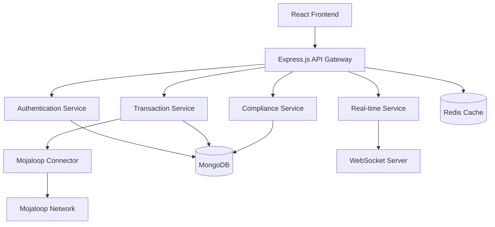

# 💰 Payments Without Borders

> Real-time cross-border payment system built with modern technologies for seamless global financial transactions.

[](https://www.typescriptlang.org/)
[](https://reactjs.org/)
[](https://nodejs.org/)
[](https://www.mongodb.com/)
[](https://redis.io/)
[](https://socket.io/)

## 🌟 Overview

Payments Without Borders is a comprehensive fintech solution that enables real-time cross-border payments using the open-source Mojaloop platform. Built with TypeScript and React, it provides a secure, scalable, and user-friendly platform for international money transfers.

## ✨ Key Features

- 🚀 **Real-time Processing** - Instant transaction processing with WebSocket notifications
- 🌍 **Cross-border Payments** - Seamless international money transfers via Mojaloop
- 💱 **Multi-currency Support** - Support for multiple currencies with real-time exchange rates
- 🔐 **Enterprise Security** - JWT authentication, encryption, and comprehensive security measures
- 📊 **KYC/AML Compliance** - Built-in compliance framework for international regulations
- 📈 **Real-time Analytics** - Live transaction monitoring and system health dashboards
- 🎯 **Modern UI/UX** - Responsive React frontend with Material-UI components
- 🔄 **API-first Design** - RESTful APIs with comprehensive OpenAPI documentation

## 🏗️ System Architecture



## 🛠️ Technology Stack

### Backend
- **Runtime**: Node.js 18+
- **Framework**: Express.js with TypeScript
- **Database**: MongoDB with Mongoose ODM
- **Cache**: Redis for session and rate limiting
- **Authentication**: JWT with bcrypt encryption
- **Real-time**: Socket.IO for live updates
- **Payment Network**: Mojaloop integration
- **API Documentation**: Swagger/OpenAPI 3.0

### Frontend
- **Framework**: React 18 with TypeScript
- **UI Library**: Material-UI (MUI)
- **State Management**: Redux Toolkit
- **Routing**: React Router v6
- **Forms**: React Hook Form with Yup validation
- **Charts**: Recharts for analytics
- **Real-time**: Socket.IO client

### DevOps & Tools
- **Containerization**: Docker & Docker Compose
- **Process Manager**: PM2
- **Code Quality**: ESLint, Prettier
- **Build Tool**: TypeScript Compiler, Vite
- **Testing**: Jest, React Testing Library

## 📋 Prerequisites

Before running this project, ensure you have:

- **Node.js** 18.0.0 or higher
- **MongoDB** 4.4 or higher
- **Redis** 6.0 or higher
- **Docker** (optional, for containerized deployment)
- **Git** for version control

## 🚀 Quick Start

### 1. Clone the Repository

```bash
git clone https://github.com/your-username/payments-without-borders.git
cd payments-without-borders
```

### 2. Backend Setup

```bash
cd backend

# Install dependencies
npm install

# Copy environment file and configure
cp .env.example .env
# Edit .env with your configuration

# Build the project
npm run build

# Start the development server
npm run dev

# Or start production server
npm start
```

### 3. Frontend Setup

```bash
cd frontend

# Install dependencies
npm install --legacy-peer-deps

# Copy environment file and configure
cp .env.example .env
# Edit .env with your configuration

# Start development server
npm start

# Or build for production
npm run build
```

### 4. Database Setup

```bash
# Start MongoDB (if not using Docker)
mongod

# Start Redis (if not using Docker)
redis-server

# The application will automatically create the required collections
```

### 5. Docker Setup (Alternative)

```bash
# Start all services with Docker Compose
docker-compose up -d

# View logs
docker-compose logs -f

# Stop services
docker-compose down
```

## 📖 API Documentation

Once the backend is running, access the interactive API documentation at:

- **Swagger UI**: http://localhost:3000/api-docs
- **OpenAPI Spec**: http://localhost:3000/api-docs.json

## 🔧 Configuration

### Backend Configuration (.env)

```env
# Server Configuration
NODE_ENV=development
PORT=3000

# Database URLs
MONGODB_URI=mongodb://localhost:27017/payments_without_borders
REDIS_URL=redis://localhost:6379

# Authentication
JWT_SECRET=your-super-secure-secret
JWT_EXPIRES_IN=24h

# Mojaloop Configuration
MOJALOOP_API_BASE_URL=http://localhost:3001
MOJALOOP_PARTICIPANT_ID=your-participant-id

# Security
ALLOWED_ORIGINS=http://localhost:3000,http://localhost:5173
RATE_LIMIT_MAX_REQUESTS=100
```

### Frontend Configuration (.env)

```env
# API Configuration
REACT_APP_API_BASE_URL=http://localhost:3000/api
REACT_APP_SOCKET_URL=http://localhost:3000

# Application Settings
REACT_APP_ENVIRONMENT=development
REACT_APP_DEFAULT_CURRENCY=USD
```

## 📁 Project Structure

```
payments-without-borders/
├── backend/                 # Node.js/Express backend
│   ├── src/
│   │   ├── controllers/     # Request handlers
│   │   ├── services/        # Business logic
│   │   ├── models/          # Database models
│   │   ├── routes/          # API routes
│   │   ├── middleware/      # Express middleware
│   │   ├── config/          # Configuration files
│   │   ├── utils/           # Utility functions
│   │   └── types/           # TypeScript definitions
│   ├── scripts/             # Deployment scripts
│   ├── dist/                # Compiled output
│   └── package.json
├── frontend/                # React frontend
│   ├── src/
│   │   ├── components/      # Reusable components
│   │   ├── pages/           # Page components
│   │   ├── services/        # API services
│   │   ├── store/           # Redux store
│   │   ├── types/           # TypeScript definitions
│   │   └── theme/           # UI theme
│   ├── public/              # Static assets
│   └── package.json
├── docker-compose.yml       # Docker services
└── README.md               # This file
```

## 🔐 Security Features

- **Authentication**: JWT-based authentication with refresh tokens
- **Authorization**: Role-based access control (RBAC)
- **Data Protection**: bcrypt password hashing, input validation
- **Rate Limiting**: Configurable rate limiting per endpoint
- **CORS**: Cross-origin resource sharing protection
- **Headers**: Security headers via Helmet.js
- **Encryption**: Data encryption for sensitive information

## 🌐 API Endpoints

### Authentication
- `POST /api/auth/register` - User registration
- `POST /api/auth/login` - User login
- `POST /api/auth/refresh` - Refresh access token
- `POST /api/auth/logout` - User logout

### Transactions
- `GET /api/transactions` - Get transaction history
- `POST /api/transactions` - Create new transaction
- `GET /api/transactions/:id` - Get transaction details
- `PUT /api/transactions/:id/status` - Update transaction status

### Cross-border Payments
- `POST /api/cross-border/quote` - Get payment quote
- `POST /api/cross-border/transfer` - Execute cross-border transfer
- `GET /api/cross-border/rates` - Get exchange rates

### User Management
- `GET /api/users/profile` - Get user profile
- `PUT /api/users/profile` - Update user profile
- `POST /api/users/kyc` - Submit KYC documents

## 🚦 Testing

### Backend Testing

```bash
cd backend

# Run all tests
npm test

# Run tests in watch mode
npm run test:watch

# Run specific test file
npm test -- transactions.test.ts
```

### Frontend Testing

```bash
cd frontend

# Run all tests
npm test

# Run tests in watch mode
npm test -- --watch

# Generate coverage report
npm test -- --coverage
```

## 📊 Monitoring & Analytics

The system includes comprehensive monitoring capabilities:

- **Transaction Monitoring**: Real-time transaction status tracking
- **System Health**: API health checks and performance metrics
- **User Analytics**: User behavior and transaction patterns
- **Error Tracking**: Comprehensive error logging and reporting

Access the admin dashboard at: http://localhost:3000/admin

## 🚀 Deployment

### Production Deployment

1. **Environment Setup**
```bash
# Set production environment variables
export NODE_ENV=production
export PORT=80
export MONGODB_URI=your-production-mongodb-uri
```

2. **Build Applications**
```bash
# Build backend
cd backend && npm run build

# Build frontend
cd frontend && npm run build
```

3. **Start Services**
```bash
# Start with PM2 (recommended)
npm install -g pm2
pm2 start ecosystem.config.js

# Or start directly
npm start
```

### Docker Deployment

```bash
# Build and deploy with Docker
docker-compose -f docker-compose.prod.yml up -d
```

### Cloud Deployment

The application is ready for deployment on:
- **AWS**: Using ECS, EC2, or Elastic Beanstalk
- **Azure**: Using App Service or Container Instances
- **Google Cloud**: Using Cloud Run or Compute Engine
- **Heroku**: Direct deployment support

## 🤝 Contributing

We welcome contributions! Please see our [Contributing Guide](CONTRIBUTING.md) for details.

1. Fork the repository
2. Create a feature branch (`git checkout -b feature/amazing-feature`)
3. Commit your changes (`git commit -m 'Add amazing feature'`)
4. Push to the branch (`git push origin feature/amazing-feature`)
5. Open a Pull Request

## 📝 License

This project is licensed under the MIT License - see the [LICENSE](LICENSE) file for details.

## 👥 Support

- **Documentation**: [Wiki](https://github.com/your-username/payments-without-borders/wiki)
- **Issues**: [GitHub Issues](https://github.com/your-username/payments-without-borders/issues)
- **Discord**: [Join our community](https://discord.gg/your-invite)
- **Email**: support@paymentswithoutborders.com

## 🗺️ Roadmap

- [ ] Mobile application (React Native)
- [ ] Advanced analytics and reporting
- [ ] Multi-language support
- [ ] Cryptocurrency integration
- [ ] AI-powered fraud detection
- [ ] Open banking integration

## 🏆 Acknowledgments

- [Mojaloop Foundation](https://mojaloop.io/) for the open-source payment platform
- [TypeScript](https://www.typescriptlang.org/) for type-safe development
- [React](https://reactjs.org/) for the fantastic UI framework
- [MongoDB](https://www.mongodb.com/) for the flexible database solution

---

**Made with ❤️ by the PayHack Team**

For questions or support, please reach out to our team or create an issue in this repository.
